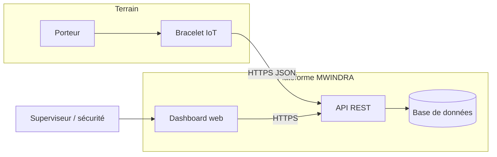
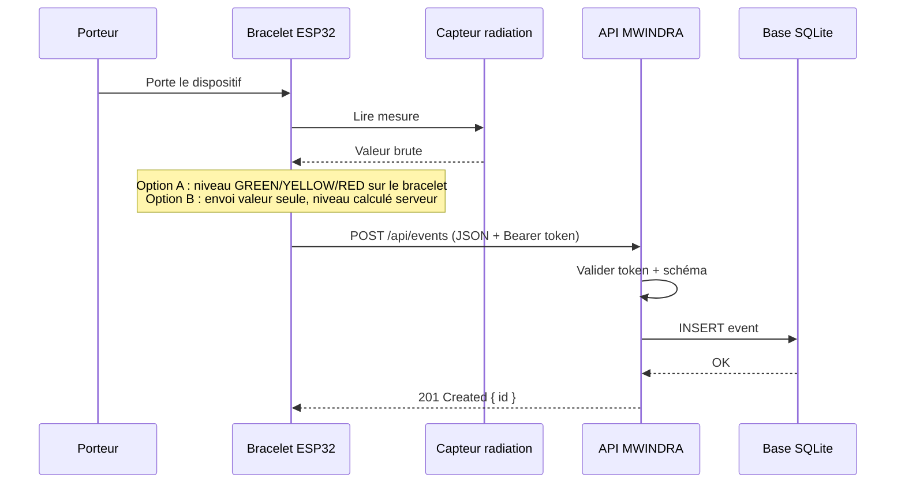
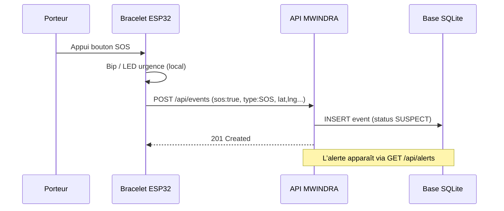
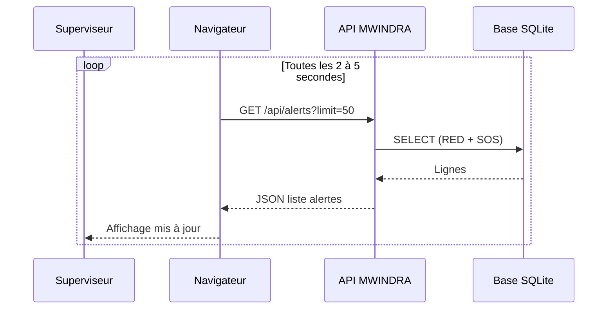
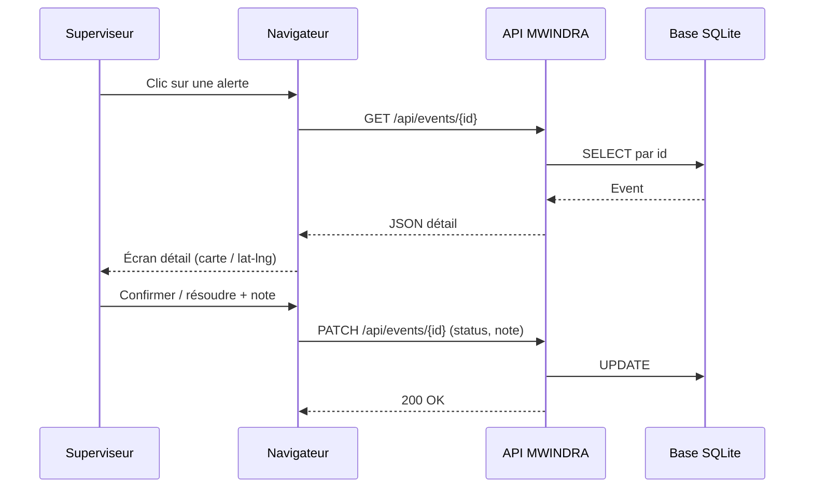
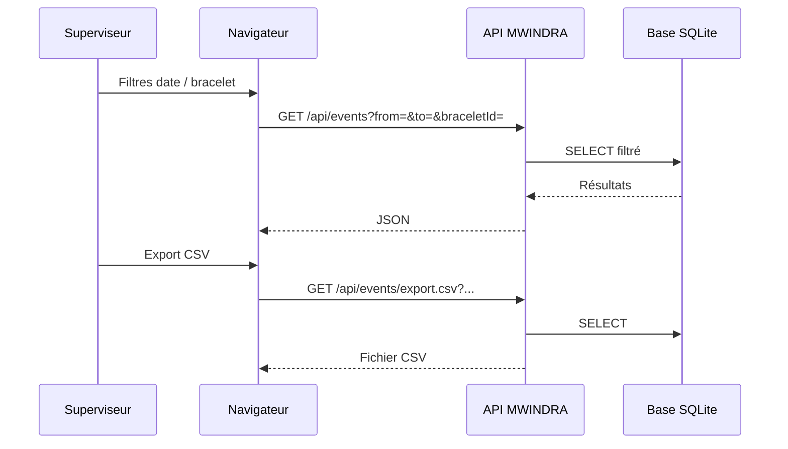
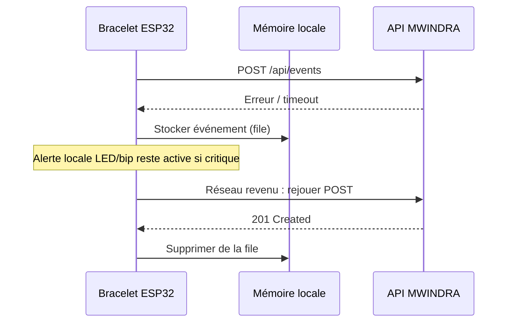
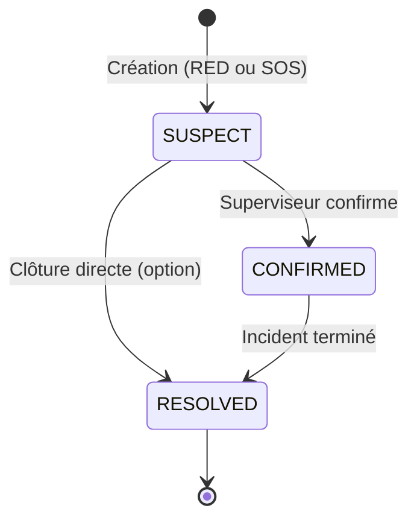
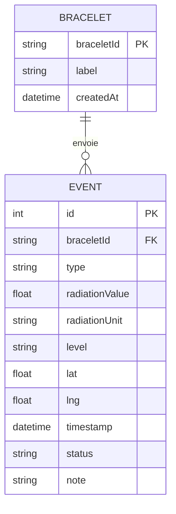
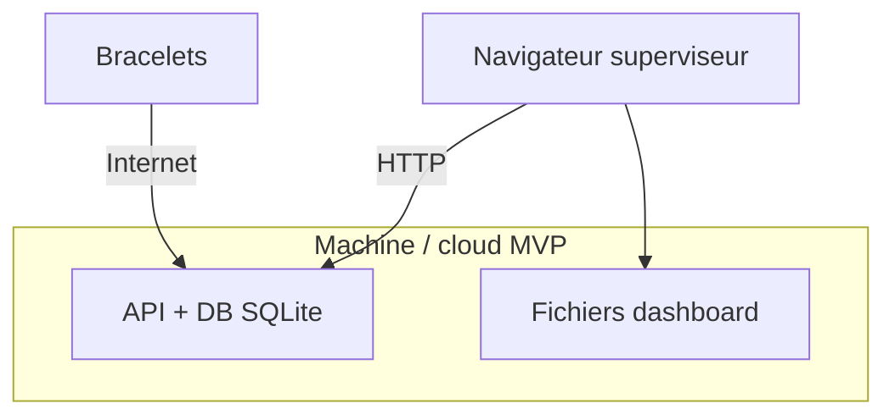

# MWINDRA — Diagrammes avant développement (séquences, contexte, états)

Document de **référence** pour aligner l’équipe **électronique / embarqué** et **logiciel** avant le code.  
Complète [`SPEC_MVP_LOGICIEL_MWINDRA.md`](SPEC_MVP_LOGICIEL_MWINDRA.md).

**Où voir les diagrammes ?** Sur GitHub (rendu Mermaid) ou sur [mermaid.live](https://mermaid.live).

---

## 1) Synthèse des flux à implémenter

| # | Flux | Acteurs | Endpoint / action clé |
|---|------|---------|------------------------|
| F1 | Mesure radiation périodique | Bracelet → API | `POST /api/events` |
| F2 | Appui SOS | Bracelet → API | `POST /api/events` (`sos: true` ou `type: SOS`) |
| F3 | Affichage alertes live | Dashboard → API | `GET /api/alerts` |
| F4 | Détail d’un événement | Dashboard → API | `GET /api/events/{id}` |
| F5 | Confirmation / clôture | Superviseur → API | `PATCH /api/events/{id}` |
| F6 | Historique / export | Superviseur → API | `GET /api/events`, `GET .../export.csv` |
| F7 | (Option) File d’attente sans réseau | Bracelet (local) | Envoi différé `POST` |

---

## 2) Diagramme de contexte (système et acteurs)



---

## 3) Diagramme de séquence — F1 : mesure radiation (envoi normal)

*Hypothèse : le bracelet a du réseau. Le serveur enregistre chaque mesure ; les alertes “liste rouge” peuvent être filtrées côté API.*



---

## 4) Diagramme de séquence — F2 : urgence SOS



---

## 5) Diagramme de séquence — F3 : tableau de bord (rafraîchissement)

*MVP classique : polling toutes les 2–5 s. Le WebSocket peut être une V2.*



---

## 6) Diagramme de séquence — F4 + F5 : ouvrir le détail puis confirmer



---

## 7) Diagramme de séquence — F6 : historique et export CSV



---

## 8) Diagramme de séquence — F7 (option) : pas de réseau puis renvoi

*À n’implémenter que si vous le tranchez dans la spec ; sinon mentionner comme “phase 2” au jury.*



---

## 9) Machine à états — statut d’un événement d’alerte



*Les mesures GREEN/YELLOW peuvent rester sans cycle SUSPECT si vous ne les traitez pas comme “alertes” dans `GET /api/alerts`.*

---

## 10) Modèle de données simplifié (ER)



---

## 11) Déploiement MVP (vue simple)



*Si API et UI sont sur le même processus (ex. FastAPI sert le `dist/` du front), une seule URL suffit.*

---

## 12) Checklist “on peut coder” (validation équipe)

- [ ] **Qui calcule le niveau** (bracelet vs serveur) est tranché.
- [ ] **Format JSON** `POST /api/events` figé (champs obligatoires / optionnels).
- [ ] **Auth** : Bearer token partagé pour le bracelet (MVP).
- [ ] **Règle** : quand `GET /api/alerts` retourne une ligne (RED seulement ? RED+SOS ? jaune inclus ?).
- [ ] **Statuts** : `SUSPECT` → `CONFIRMED` / `RESOLVED` compris par tous.
- [ ] **Scénario démo** F1 + F2 + F5 répété sans erreur.

---

## 13) Légende des messages (exemple JSON minimal)

**Mesure radiation**

```json
{
  "braceletId": "BR-001",
  "timestamp": "2026-04-10T14:00:00Z",
  "type": "RADIATION",
  "radiationValue": 0.42,
  "radiationUnit": "uSv/h",
  "level": "YELLOW",
  "lat": -4.32,
  "lng": 15.31
}
```

**SOS**

```json
{
  "braceletId": "BR-001",
  "timestamp": "2026-04-10T14:02:00Z",
  "type": "SOS",
  "sos": true,
  "lat": -4.32,
  "lng": 15.31
}
```

---

*Fin du document — à versionner avec le reste du repo MWINDRA.*
