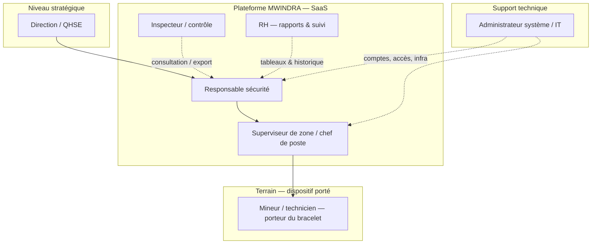

# MWINDRA — Organigramme des utilisateurs du système

Ce schéma décrit **qui utilise quoi** : bracelet (terrain) vs plateforme **SaaS** (supervision). À adapter selon votre organisation réelle.

---

## Vue hiérarchique (Mermaid)

> Affichage : GitHub affiche le diagramme ; sinon copier le bloc dans [mermaid.live](https://mermaid.live).



**Lecture rapide**

- **Flèche pleine** : chaîne opérationnelle classique (décision → terrain).
- **Flègle pointillée** : accès transversal (contrôle, RH, IT).

---

## Rôles et usage (résumé)

| Rôle | Utilise surtout | Rôle dans MWINDRA |
|------|-----------------|-------------------|
| **Porteur du bracelet** | Bracelet IoT | Mesures, alertes locales, SOS |
| **Superviseur** | SaaS (dashboard) | Voir alertes en temps réel, détails, statuts |
| **Responsable sécurité** | SaaS | Supervision globale, validation incidents, procédures |
| **Inspecteur** | SaaS (lecture) | Contrôle, exports, preuves |
| **Direction / QHSE** | SaaS (synthèses) | Indicateurs, décisions stratégiques |
| **RH** | SaaS (option / phase 2) | Bilan incidents, lien formation / dossiers |
| **Admin IT** | Console admin / infra | Comptes, sauvegardes, disponibilité |

---

## Version texte (si pas de rendu Mermaid)

```
                    Direction / QHSE
                            |
                Responsable sécurité
                     /            \
         Superviseur de zone    Inspecteur
                |
         Porteur du bracelet
    (mineur / technicien)

    RH --------------> (accès rapports, phase 2)
    Admin IT --------> (comptes & infrastructure)
```

---

## Note pour la présentation jury

- **Utilisateur principal SaaS** : superviseur + responsable sécurité (alertes immédiates).  
- **Utilisateur principal terrain** : porteur du bracelet.  
- **RH et Direction** : utiles pour le **modèle économique** et la **gouvernance**, souvent en **consultation** ou **phase 2** pour ne pas surcharger le MVP.
